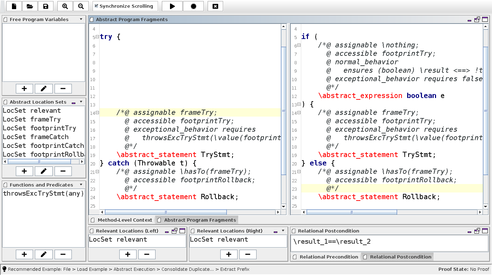

# REFINITY Documentation

REFINITY is a workbench for modeling and verifying Java-based program transformation rules. It is based on KeY and Abstract Execution.

## Getting Started

REFINITY is an add-on to the [KeY program prover](https://www.key-project.org). As of Aug 2020, it is available in the ["AbstractExecution" branch](https://git.key-project.org/key/key/-/tree/AbstractExecution) of KeY. It is planned to merge it into the master branch until end 2020.

You can start REFINITY from within the graphical KeY user interface by pressing the big "REFINITY" button. If you do not see this button, check that you (1)  use an up-to-date KeY version with Abstract Execution, and (2) the REFINITY extension is activated: In the GUI, choose Options > Show Settings > Extensions, check AE-Relational, apply and restart.

## The User Interface

The REFINITY user interface consists mainly of two panes for Abstract Program Fragments (APFs), i.e., sequences of statements with Abstract Program Elements (APEs). An APE is either an Abstract Statement (AS) or an Abstract Expression (AExp).

On the left-hand side of the user interface, symbols used in the APFs can be declared: Program variables which can be used in both programs without declaration, abstract, set-valued specification variables for I/O specifications of APEs, and abstract function / predicate symbols that can primarily be used for specifying abstract abrupt completion behavior and abstract loop invariants.

The three compartments at the bottom serve to declare pre- and postconditions of the model.

In the next section, we explain how abstract programs are specified; afterward, we move to the specification of pre- and postconditions.

- [ ] Tooltips
- [ ] Control bar buttons

## Specifying Abstract Programs

In progress.

The specification language is described in-depth in reference [2].

## Declaring Proof Goals

In progress.

## Proof Search and Certification

In progress.

## File Format

In progress.

## References

1. [Dominic Steinhöfel](https://dblp.uni-trier.de/pid/188/4887.html) : "REFINITY to Model and Prove Program Transformation Rules." APLAS 2020, *accepted*.
2. [Dominic Steinhöfel](https://dblp.uni-trier.de/pid/188/4887.html) : "Abstract Execution: Automatically Proving Infinitely Many Programs." Darmstadt University of Technology, Germany, 2020
3. [Dominic Steinhöfel](https://dblp.uni-trier.de/pid/188/4887.html), [Reiner Hähnle](https://dblp.uni-trier.de/pid/h/ReinerHahnle.html): "Abstract Execution." [FM 2019](https://dblp.uni-trier.de/db/conf/fm/fm2019.html#SteinhofelH19): 319-336

----

REFINITY has been developed by Dominic Steinhöfel.